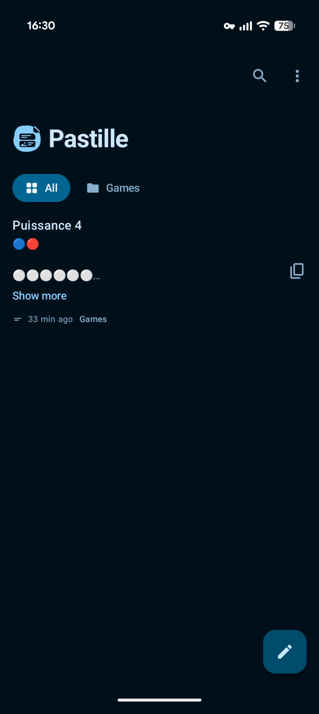
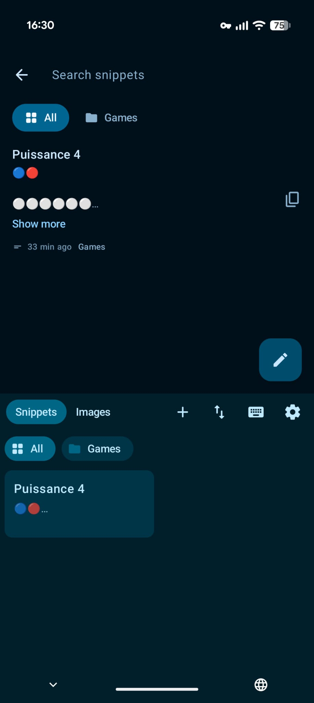
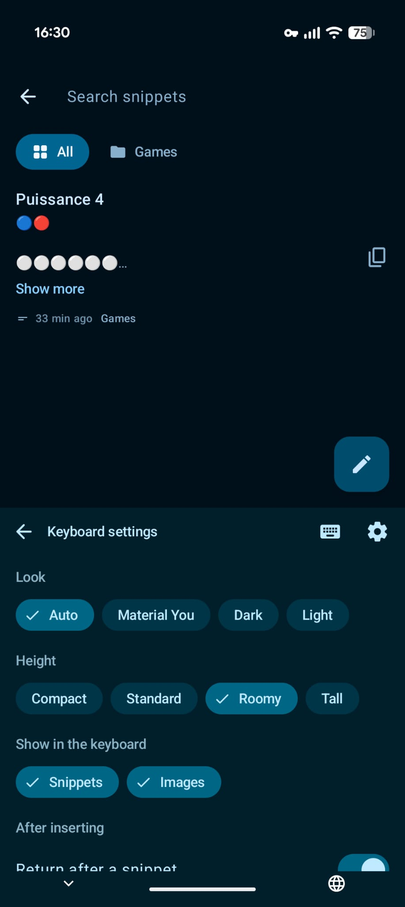

<div align="center">


# Pastille

**A keyboard you switch to only when you want to paste.**

[](https://github.com/kud/pastille/actions/workflows/ci.yml)
[](https://github.com/kud/pastille/releases)
[](LICENSE)






</div>

Pastille is an open-source Android keyboard for pasting, not typing. Tap a saved snippet or a recent image and it goes straight into the text field, then Pastille hands you back to your usual keyboard.

## Features

- Your own snippets, written in the app or saved from the clipboard.
- Folders for snippets, with an "All" view, and drag to reorder snippets and folders right in the keyboard.
- Recent images from the folders you choose (Screenshots, Camera, Downloads and so on), inserted as images where the app accepts them and copied to the clipboard where it does not.
- Your own stickers in their own tab, from the photo picker or the share sheet, with transparent PNG, WebP and animated GIF/WebP kept as they are. Never packs.
- Share text or an image from any app to Pastille to keep it as a snippet.
- A Quick Settings tile that opens your snippets as a sheet to copy from, in any app.
- Choose, separately for snippets and images, whether to return to your usual keyboard after inserting, and which keyboard that is.
- Turn snippets, stickers or images off entirely if you only need some of them.
- Gboard-style dark, light and Material You themes, with a choice of panel heights.
- Back up and restore your snippets as a JSON file.

## Install

- **GitHub Releases:** download the latest APK from the [releases page](https://github.com/kud/pastille/releases) and open it on your phone. You may need to allow installs from your browser or file manager.
- **F-Droid:** coming soon.

Pastille needs Android 9 (API 28) or later.

## How to enable the keyboard

1. Open the Pastille app and follow the setup card, or do it by hand in the next steps.
2. Enable Pastille under Settings → System → Keyboard → On-screen keyboard.
3. In any text field, switch to Pastille with the keyboard switcher, or use "Try the keyboard" in the app's menu.
4. Optionally, grant photo access in Pastille's Settings to see recent images in the panel.

### Quick Settings tile

The Pastille Quick Settings tile opens a sheet of your snippets and recent images over whatever app is open. Tap one to copy it to the clipboard; long-press for its actions. If the phone is locked, it asks you to unlock first. The keyboard button in the sheet's header opens the system keyboard picker.

## Privacy

- Pastille requests no `INTERNET` permission and has no analytics or network libraries. Your snippets and images never leave your phone.
- Snippets live in a local Room database on your device.
- Backups only move when you ask: export and import go through the system file picker (Storage Access Framework), so you choose where the file is saved or read from.
- Photo access is optional and only used to show recent images in the panel.

## Build

Requires JDK 17 or later and the Android SDK. The Gradle wrapper is checked in.

```sh
./gradlew assembleDebug testDebugUnitTest lintDebug
```

Or open the directory in Android Studio and run the `app` configuration on a device or emulator. CI runs the same three tasks on every push and pull request to `main`.

## Documentation

- [Design spec](docs/design-spec.md): how the keyboard and app look and behave.
- [Architecture](docs/architecture.md): schema, storage, image handling and the Quick Settings tile mechanics.

## Licence

Copyright (c) 2026 Erwann Mest. Released under the GNU General Public License v3.0 or later; see [LICENSE](LICENSE).
